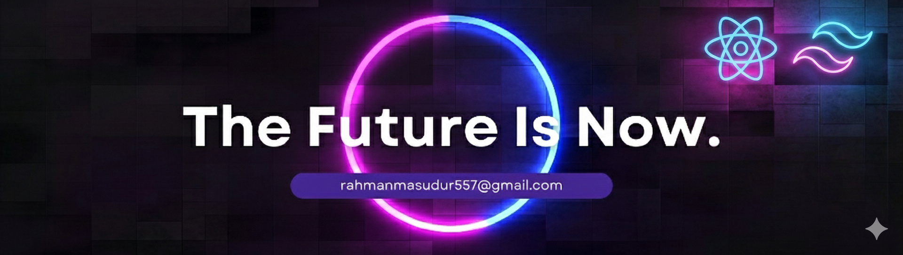

## Hi 👋 I'm Masudur Rahman  
### Frontend Web Developer

I am an aspiring frontend web developer passionate about building clean and user-friendly web applications.  
I enjoy learning modern web technologies and applying them to real-world projects.  
I am continuously improving my skills through practice and hands-on development.

- 🌱 Exploring Next.js  
- 🛠 Working on a Food Delivery website  
- 📚 Improving React and frontend skills

### 🛠 Skills

**Frontend:**  

**Tools:**  

### 📊 GitHub Stats

<!-- Contribution Graph -->

<!-- Followers & Repos Badges -->

<!-- Top Languages -->
**Top Languages:**

